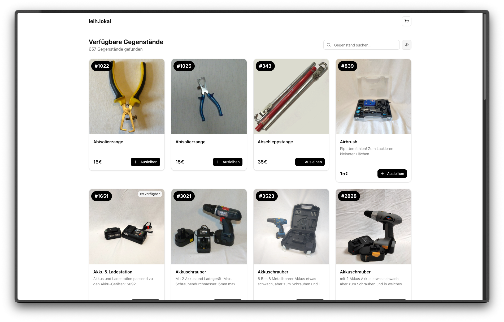

# leih.lokal Reservierung

Self-service reservation system for lending libraries. Allows customers to browse items, add them to a cart, and create pickup reservations.



## Requirements

This app requires [leih-lokal/leihbackend](https://github.com/leih-lokal/leihbackend) as the PocketBase backend.

For managing items and reservations, use [leih-lokal/llka-verwaltung](https://github.com/leih-lokal/llka-verwaltung).

## Tech Stack

- **Frontend**: Next.js 16, React 19, TypeScript
- **UI**: Shadcn/ui + Tailwind CSS 4
- **Forms**: React Hook Form + Zod
- **Backend**: PocketBase (external)

## Getting Started

### Prerequisites

- Node.js 20+ and npm
- PocketBase instance with `item_public` and `reservation` collections

### Installation

1. **Clone the repository**

```bash
git clone <repository-url>
cd llka-resomaker
```

2. **Install dependencies**

```bash
npm install
```

3. **Configure environment variables**

```bash
cp .env.local .env.local.backup
```

Edit `.env.local` and set your PocketBase URL:

```env
NEXT_PUBLIC_API_BASE=http://localhost:8090
```

See [CONFIG.md](./CONFIG.md) for all available configuration options.

4. **Run the development server**

```bash
npm run dev
```

Open [http://localhost:3000](http://localhost:3000) in your browser.

## Configuration

The app is fully configurable through environment variables:

| Category | Examples |
|----------|----------|
| **Branding** | Name, tagline, logo, accent color |
| **Features** | Search, availability toggle, item IDs, detail pages |
| **Limits** | Cart size, pickup days, items per page |
| **Display** | Currency symbol, opening hours |

See [CONFIG.md](./CONFIG.md) for complete documentation.

## Docker

Build and run with Docker:

```bash
# Using docker-compose
docker-compose up --build

# Or build with custom config
docker build \
  --build-arg NEXT_PUBLIC_API_BASE=https://api.example.com \
  --build-arg NEXT_PUBLIC_BRAND_NAME="My Library" \
  --build-arg NEXT_PUBLIC_BRAND_ACCENT="#2563eb" \
  -t reservation-app .

docker run -p 3000:3000 reservation-app
```

**Note:** Configuration is baked in at build time. Rebuild to change settings.

## Project Structure

```
/app
  /[iid]              # Item detail pages
  /checkout           # Checkout flow
  /success            # Reservation confirmation
  /api/proxy          # CORS proxy for PocketBase
/components
  /ui                 # Shadcn UI components
  /layout             # Header, footer
  /catalog            # Item grid, search, pagination
  /cart               # Cart sheet and items
  /checkout           # Reservation form, pickup selector
  /item               # Item detail view
/lib
  /api                # PocketBase API client
  /config             # Environment configuration
  /constants          # Opening hours
  /types              # TypeScript types
  /utils              # Utilities (calendar export)
  /validation         # Zod schemas
/context
  /cart-context       # Shopping cart state
  /config-context     # Configuration provider
```

## Available Scripts

- `npm run dev` - Start development server
- `npm run build` - Build for production
- `npm start` - Start production server
- `npm run lint` - Run ESLint

## Features

- **Item Catalog**: Browse items with search, filtering, and pagination
- **Availability Filter**: Toggle between available and all items
- **Shopping Cart**: Add/remove items, persisted to localStorage
- **Pickup Scheduling**: Select date and time based on opening hours
- **Reservation Form**: Email and optional comments
- **Calendar Export**: Add pickup to Google, Apple, or Outlook calendar
- **Responsive Design**: Works on mobile and desktop

## API Requirements

See [leih-lokal/leihbackend](https://github.com/leih-lokal/leihbackend) for the required PocketBase schema. The app uses:

- `item_public` collection (read-only view of items)
- `reservation` collection (for creating reservations)

## Deployment

### Static Export

```bash
npm run build
```

Deploy the `.next/standalone` directory.

### Docker

See [Docker](#docker) section above.

### Reverse Proxy

If running behind a reverse proxy, ensure WebSocket support for development hot reload.

## License

[Add license information]
